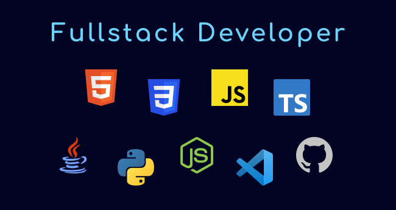
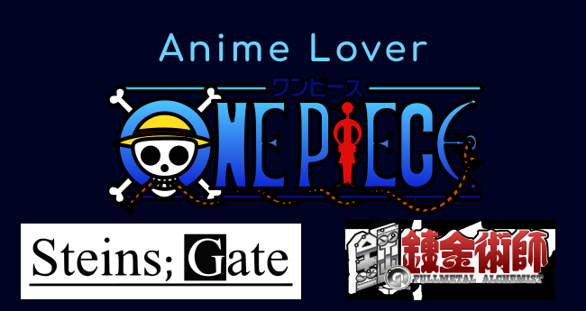

<h1 align="center">
    Hello There
</h1>

    

    

    
    &nbsp;&nbsp;
    

## About Me
I enjoy learning in general, especially anything that's STEM, but the things I enjoy the most are learning programming, creating apps, and learning languages (both human and programming ones!).

I currently speak three languages:
- Italian (Native)
- English (Intermediate)
- Japanese (Beginner)

I'm currently learning:
- sveltekit
- nestjs
- typescript

    
    

